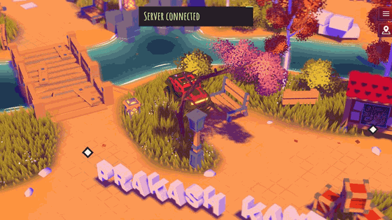

# Prakash's — Interactive 3D Portfolio

[](https://github.com/Kantamaniprakash/prakash-folio/actions/workflows/deploy.yml)



An interactive 3D driving experience — hop in the car, explore the island, knock things over, and discover the work of **Prakash Kantamani**, Data Scientist & Gen AI Engineer.

## 🔗 Live

| | |
|---|---|
| 🎮 **Portfolio** | [kantamaniprakash.github.io/prakash-folio](https://kantamaniprakash.github.io/prakash-folio/) |
| 📊 **Analytics** | [Live visitor funnel](https://kantamaniprakash.github.io/prakash-folio/analytics.html) — self-hosted, anonymous |
| 🐙 **GitHub** | [github.com/kantamaniprakash](https://github.com/kantamaniprakash) |
| 💼 **LinkedIn** | [linkedin.com/in/prakash-kantamani](https://linkedin.com/in/prakash-kantamani) |

## ✨ Highlights

- 🚗 Drivable physics vehicle with dynamic objects you can crash into
- 🏝️ Fully explorable 3D island — projects, career, achievements, and more
- 🌦️ Day/night cycles, seasons, and live weather (rain, snow, lightning, tornado!)
- 🎳 Mini-games — bowling, a race circuit, hidden easter eggs
- 🔊 Spatial audio and original music
- ⚡ Runs on WebGPU (with WebGL fallback) at 60fps

## 🛠️ Tech Stack

| Layer | Technology |
|---|---|
| Rendering | [Three.js](https://threejs.org) (WebGPU / TSL node materials) |
| Physics | [Rapier](https://rapier.rs) (WASM) |
| Audio | [Howler.js](https://howlerjs.com) |
| Tooling | [Vite](https://vitejs.dev), [Blender](https://www.blender.org) for all 3D assets |
| Deploy | GitHub Pages |

## 🚀 Getting Started

Create a `.env` file based on `.env.example`, install [Node.js](https://nodejs.org/en/download/), then:

``` bash
# Install dependencies
npm install --force

# Serve at localhost:5173
npm run dev

# Build for production in the dist/ directory
npm run build
```

## 🎮 Engine Notes

<details>
<summary><strong>Game loop — tick order</strong></summary>

#### 0

- Time
- Inputs

#### 1

- Player:pre-physics (Inputs)

#### 2

- PhysicalVehicle:pre-physics (Player:pre-physics)

#### 3

- Physics

#### 4

- PhysicsWireframe (Physics)
- Objects (Physics)

#### 5

- PhysicalVehicle:post-physics (Player:pre-physics)

#### 6

- Player:post-physics (Physics, PhysicalVehicle:post-physics)

#### 7

- View (Inputs, Player:post-physics)

#### 8

- Intro
- DayCycles
- YearCycles
- Weather (DayCycles, YearCycles)
- Zones (Player:post-physics)
- VisualVehicle (PhysicalVehicle:post-physics, Inputs, Player:post-physics, View)

#### 9

- Wind (Weather)
- Lighting (DayCycles, View)
- Tornado (DayCycles, PhysicalVehicle)
- InteractivePoints (Player:post-physics)
- Tracks (VisualVehicle)

#### 10

- Area++ (View, PhysicalVehicle:post-physics, Player:post-physics, Wind)
- Foliage (VisualVehicle, View)
- Fog (View)
- Reveal (DayCycles)
- Terrain (Tracks)
- Trails (PhysicalVehicle)
- Floor (View)
- Grass (View, Wind)
- Leaves (View, PhysicalVehicle)
- Lightnings (View, Weather)
- RainLines (View, Weather, Reveal)
- Snow (View, Weather, Reveal, Tracks)
- VisualTornado (Tornado)
- WaterSurface (Weather, View)
- Benches (Objects)
- Bricks (Objects)
- ExplosiveCrates (Objects)
- Fences (Objects)
- Lanterns (Objects)
- Whispers (Player)

#### 13

- InstancedGroup (Objects, [SpecificObjects])

#### 14

- Audio (View, Objects)
- Notifications
- Title (PhysicalVehicle:post-physics)

#### 998

- Rendering

#### 999

- Monitoring

</details>

<details>
<summary><strong>Blender — export & compression pipeline</strong></summary>

### Export

- Mute the palette texture node (loaded and set in Three.js `Material` directly)
- Use corresponding export presets
- Don't use compression (will be done later)

### Compress

Run `npm run compress`

Will do the following

#### GLB

- Traverses the `static/` folder looking for glb files (ignoring already compressed files)
- Compresses embeded texture with `etc1s --quality 255` (lossy, GPU friendly)
- Generates new files to preserve originals

#### Texture files

- Traverses the `static/` folder looking for `png|jpg` files (ignoring non-model related folders)
- Compresses with default preset to `--encode etc1s --qlevel 255` (lossy, GPU friendly) or specific preset according to path
- Generates new files to preserve originals

#### UI files

- Traverses the `static/ui.` folder looking for `png|jpg` files
- Compresses to WebP

#### Resources

- https://gltf-transform.dev/cli
- https://github.com/KhronosGroup/KTX-Software?tab=readme-ov-file
- https://github.khronos.org/KTX-Software/ktxtools/toktx.html

</details>

## 📬 Contact

**Prakash Kantamani** — Data Scientist & Gen AI Engineer
📍 Richardson, TX · ✉️ [prakashkantamani90@gmail.com](mailto:prakashkantamani90@gmail.com)

## 📄 License

[MIT](./license.md)
